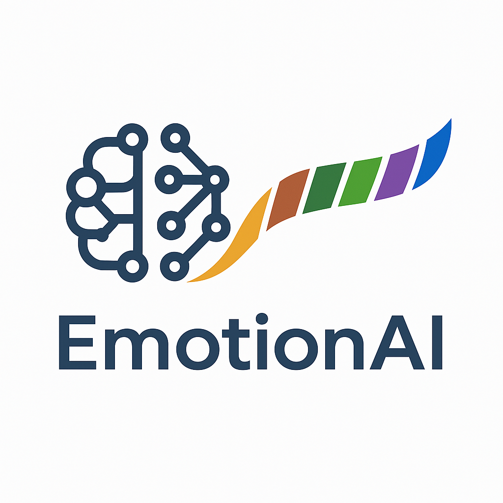
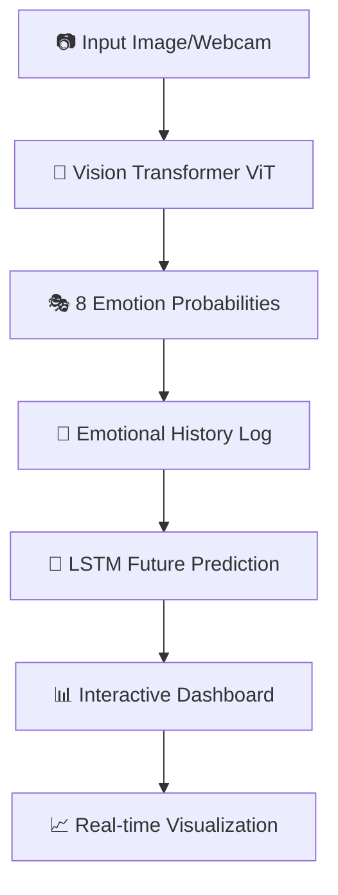

# 🧠✨ Emotion AI: Real-time Emotion Recognition with Future Prediction

<div align="center">
  
  
  [](https://emotionai-hackwgaveesh.streamlit.app/)
  
  
  
</div>

---

## 🌟 Overview

**Emotion AI** is an advanced Streamlit web application that performs real-time emotion recognition from images and webcam feeds, and uniquely offers future emotion prediction capabilities. Leveraging a fine-tuned Vision Transformer (ViT) for accurate emotion detection and a Long Short-Term Memory (LSTM) neural network for forecasting emotional trends, this app provides comprehensive insights into emotional states.

## ✨ Features

### 📸 **Image-based Emotion Analysis**
Upload an image and get instant emotion probabilities across 8 different categories with detailed visual feedback.

### 🎥 **Real-time Webcam Analysis** 
Utilize your device's camera for live emotion detection and continuous tracking of emotional shifts in real-time.

### 🔮 **Future Emotion Prediction**
An LSTM model learns from your emotional history to predict likely future emotional states - a unique feature that sets this apart!

### 📊 **Interactive Analytics Dashboard**
Visualize your emotional journey over time with detailed charts, including:
- 📈 **Emotional Journey Timeline** (Line Chart)
- 🔥 **Emotion Intensity Heatmap**
- 🥧 **Dominant Emotions Distribution** (Pie Chart)
- 🎯 **Emotional State Radar Chart**

### 🎭 **8 Emotion Categories**
Detects and predicts: `amusement` 😄 | `anger` 😠 | `awe` 😲 | `contentment` 😌 | `disgust` 🤢 | `excitement` 🤩 | `fear` 😨 | `sadness` 😢

### 🔧 **Additional Features**
- 🧹 **Clearable History**: Reset all collected emotion data
- 💾 **Downloadable Data**: Export emotional history as CSV for further analysis

---

## 🛠️ Technologies Used

<div align="center">

| Technology | Purpose | Badge |
|------------|---------|-------|
| **Streamlit** | Interactive web application |  |
| **PyTorch** | Deep learning framework |  |
| **Hugging Face** | Vision Transformer model |  |
| **OpenCV** | Webcam integration |  |
| **Plotly** | Interactive visualizations |  |

</div>

---

## 🚀 How it Works



1. **🎯 Emotion Detection (ViT)**: A pre-trained Vision Transformer model, fine-tuned for facial emotion classification, processes input images or webcam frames, outputting probabilities for 8 distinct emotions.

2. **📋 Emotional History Tracking**: Detected emotion probabilities are logged with timestamps, creating a continuous emotional timeline.

3. **🔮 Future Prediction (LSTM)**: An LSTM neural network continuously updates with emotional history, learning sequences and patterns to predict future emotional states.

4. **📊 Interactive Visualization**: Streamlit and Plotly present current emotions, predicted future emotions, and historical trends through various interactive charts.

---

## 💻 Setup and Installation

### 📋 Prerequisites
- Python 3.8+
- Webcam (for real-time analysis)
- Internet connection (for model downloads)

### 🔧 Installation Steps

1. **📥 Clone the Repository**:
   ```bash
   git clone https://github.com/HackWGaveesh/emotion-ai-app.git
   cd emotion-ai-app
   ```

2. **🐍 Create a Virtual Environment** (Recommended):
   ```bash
   python -m venv venv
   
   # On Windows
   .\venv\Scripts\activate
   
   # On macOS/Linux
   source venv/bin/activate
   ```

3. **📦 Install Dependencies**:
   ```bash
   pip install -r requirements.txt
   ```

4. **🤖 Download Pre-trained Models**:
   - `emotion_vit_finetuned.pth`: Fine-tuned ViT model weights
   - `saved_model/`: ViT image processor directory
   
   *Ensure these files are in the root directory and `saved_model` directory respectively.*

5. **🚀 Run the Streamlit App**:
   ```bash
   streamlit run app.py
   ```
   
   🎉 The application will open in your default web browser!

---

## 📁 Project Structure

```
📂 emotion-ai-app/
├── 🐳 .devcontainer/              # Development container config
├── 🤖 saved_model/                # ViT Image Processor
│   └── (processor files)
├── 🖼️ Default_image.png           # Demo image
├── 🎨 Logo.png                    # Application logo
├── 🚀 app.py                      # Main Streamlit application
├── 🧠 emotion_vit_finetuned.pth   # Fine-tuned ViT weights
├── 📖 readme.md                   # This README file
└── 📋 requirements.txt            # Python dependencies
```

---

## 🎮 Usage Guide

### 📸 Image Analysis Tab
1. Navigate to the **"Image Analysis"** tab
2. Click **"Choose an image with a face..."** to upload
3. View instant emotion analysis with detailed breakdown and radar chart
4. Get future emotion predictions (when sufficient history is available)

### 🎥 Real-time Webcam Tab  
1. Go to the **"Real-time Webcam"** tab
2. Click **"▶️ Start Camera"** to activate webcam
3. Watch real-time emotion analysis and predictions
4. Use **"⏹️ Stop Camera"** to halt feed
5. **"🧹 Clear History"** to reset webcam data

### 📊 Analytics Dashboard Tab
1. Visit the **"Analytics Dashboard"** tab
2. Explore comprehensive emotional data visualization
3. View interactive charts of your emotional journey
4. Download raw data as CSV
5. Option to clear all historical data

---

## 🤝 Contributing

We welcome contributions! 🎉 Here's how you can help:

1. 🍴 **Fork** the repository
2. 🌟 **Create** a feature branch (`git checkout -b feature/AmazingFeature`)
3. 💾 **Commit** your changes (`git commit -m 'Add some AmazingFeature'`)
4. 📤 **Push** to the branch (`git push origin feature/AmazingFeature`)
5. 🔄 **Open** a Pull Request

### 💡 Ideas for Contribution
- 🎨 UI/UX improvements
- 🧠 Additional emotion categories
- 📊 New visualization types
- 🔧 Performance optimizations
- 📚 Documentation enhancements

---

## 📄 License

This project is licensed under the MIT License - see the [LICENSE](LICENSE) file for details.

---

## 🙏 Acknowledgments

- 🤗 **Hugging Face** for the Vision Transformer models
- 🎨 **Streamlit** team for the amazing framework
- 🧠 **PyTorch** community for deep learning tools
- 📊 **Plotly** for interactive visualizations

---

<div align="center">

## 💬 Get in Touch

Have questions, suggestions, or just want to chat about AI and emotions? 

[](https://github.com/HackWGaveesh)
[](mailto:your-email@example.com)

---

**⭐ If you found this project helpful, please consider giving it a star! ⭐**

Created with ❤️ by **HackWGaveesh**

*"Understanding emotions through AI - bridging the gap between technology and human feelings"* 🌈

</div>
